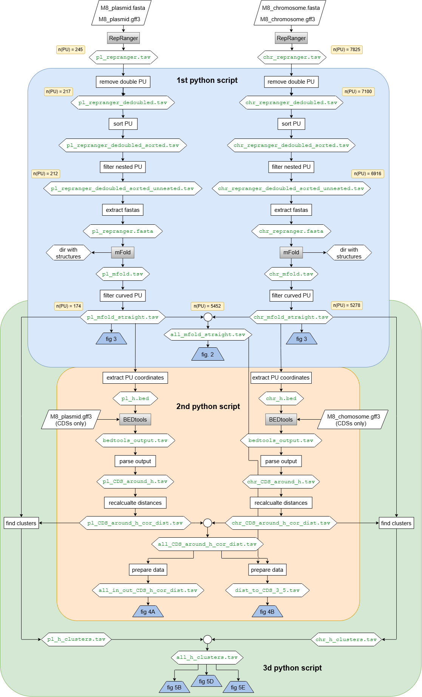

# palindromic-units-m8

## Overview

This repository contains the analysis scripts for the manuscript
**"Palindromic units in the genome of *Rhodococcus rhodochrous* M8 — a platform
strain for industrial biotechnology"**.

The scripts process palindromic units (PUs) identified in the *R. rhodochrous*
M8 genome by **Repranger**, a putative palindromic element prediction tool.

Such elements provide the basis for developing genus-specific tools for targeted
regulation of gene expression in *R. rhodochrous* M8-based strains, thereby
facilitating the development of biotechnology based on this family of strains.

The project includes analysis of the predicted PUs' genomic distribution,
localization relative to CDSs, structural features, and clustering patterns.

## Repository Contents

| Folder | Description |
|---|---|
| `data/` | Source input files required to run the scripts |
| `results/` | Figures and tables presenting the main results |
| `intermediates/` | All intermediate files generated and partially reused by the scripts |
| `scripts/` | The three analysis scripts |

## Scripts

The project consists of three scripts:

1. **Script 1** filters out repeated, nested and curved PUs, and calculates
   their secondary structures using mFold;
2. **Script 2** determines the two CDS surrounding each PU, along with their
   direction and distance in nt;
3. **Script 3** clusters the PUs.

> **Runtime output:** When the scripts are run, they create a `code_output/`
> directory for freshly generated files. This directory is not tracked by Git.
> The scripts are intended to be run in order 1 → 2 → 3, since each script depends 
> on outputs from the previous one(s). However, if `code_output/` is missing or lacks 
> the required files, the scripts will fall back to the pre-computed files in `intermediates/`.

## Dependencies

### Python Environment
- Python 3.8
- Install required packages with:
  ```bash
  pip3 install -r requirements.txt

### External Tools

- **mFold** (v3.6)
- **BEDtools** (v2.30.0)

Both executables must be available on the system `PATH`.

## Runtime Notes

The first script generates folders containing images of all PU structures as a
by-product of mFold. This step takes approximately 30 minutes with 4 CPU cores, 5 GB RAM and produces 45 MB of output.

## Workflow Diagram



## License

This project is licensed under the MIT License. See the [LICENSE](LICENSE) file for details.

## References

This project relies on the following external software:

- **RepRanger** (for initial palindromic unit identification)
  - Murashko, O. N., et al. (2025). *mSphere*. DOI: [10.1128/msphere.00124-25](https://doi.org/10.1128/msphere.00124-25)
  - Web server: [https://bc.imb.sinica.edu.tw/RepRanger/](https://bc.imb.sinica.edu.tw/RepRanger/)

- **mFold** (for secondary structure prediction)
  - Zuker, M. (2003). *Nucleic Acids Research*. DOI: [10.1093/nar/gkg595](https://doi.org/10.1093/nar/gkg595)

- **BEDtools** (for genomic interval operations)
  - Quinlan, A. R., & Hall, I. M. (2010). *Bioinformatics*. DOI: [10.1093/bioinformatics/btq033](https://doi.org/10.1093/bioinformatics/btq033)


